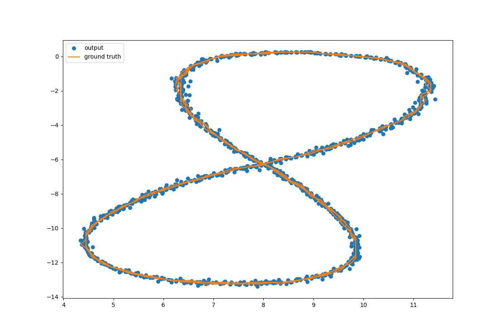
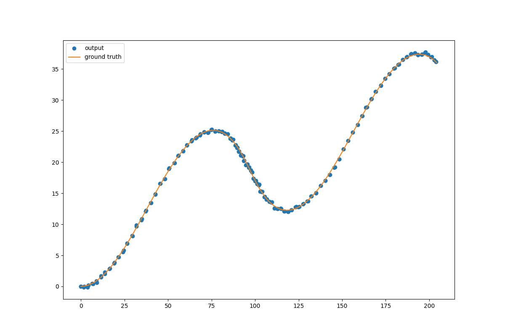

# KalmanFusion
## Introduction 介绍
这是一个使用卡尔曼滤波器（KF）和扩展卡尔曼滤波器（EKF）对激光雷达和毫米波雷达观测数据进行融合处理的应用。
## Environment 环境
程序可在Windows和树莓派Linux环境下运行

Windows：
- Windows 10
- cmake version 3.16.5
- gcc version 8.1.0

Linux：
- Raspbian GNU/Linux 10 (buster)
- cmake version 3.16.3
- gcc version 8.3.0

### Dependencies:
- Cmake - an open-source, cross-platform family of tools designed to build, test and package software. 
- Eigen - a C++ template library for linear algebra: matrices, vectors, numerical solvers, and related algorithms.

## Run 运行
### build:
```shell script
mkdir build
cd build
cmake ..
make
cd ../bin
./KalmanFusion_d
```
### clone:

`git clone git@github.com:bin3826246/KalmanFusion.git`

## Input
- input file:
```
L(for lidar) m_x m_y t gt_x gt_y gt_vx gt_vy
R(for radar) m_rho m_phi m_rho_dot t gt_x gt_y gt_vx gt_vy

Where:
(m_x, m_y) - measurements by the lidar
(m_rho, m_phi, m_drho) - measurements by the radar in polar coordinates
(t) - timestamp in unix/epoch time the measurements were taken
(gt_x gt_y gt_vx gt_vy) - the real ground truth state of the system
```
## Output
- output file:
```
out-*.txt:
p_x p_y p_vx p_vy

Where:
(p_x, p_y, p_vx, p_vy) - the predicted state of the system by FusionEKF

gt-*.txt:
gt_x gt_y gt_vx gt_vy

Where:
(gt_x gt_y gt_vx gt_vy) - the real ground truth state of the system
```
## Plot
- out-1.txt



- out-2.txt:


